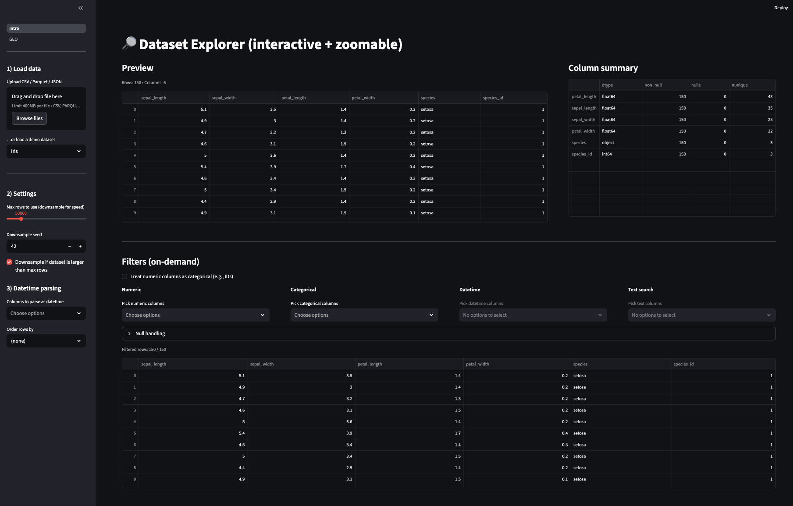
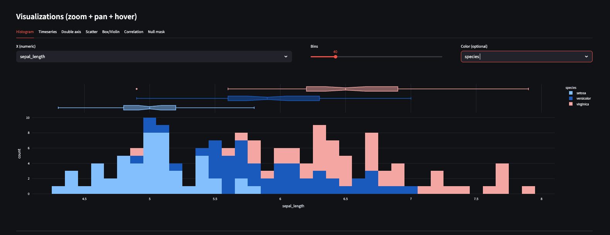
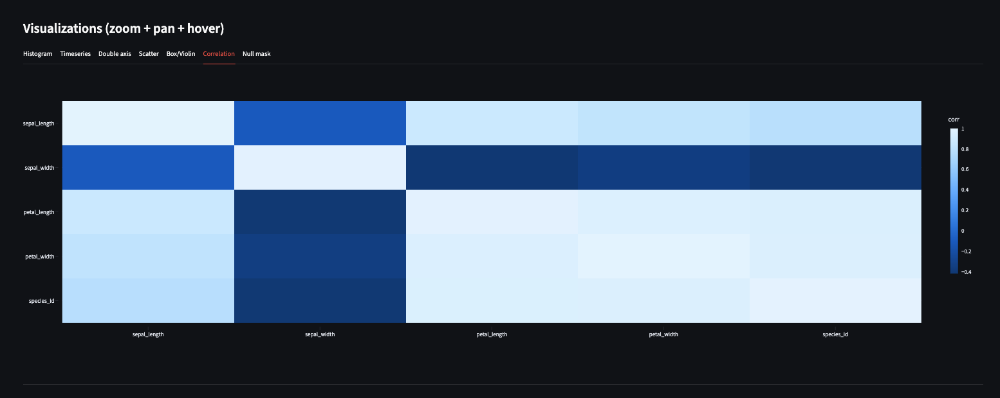
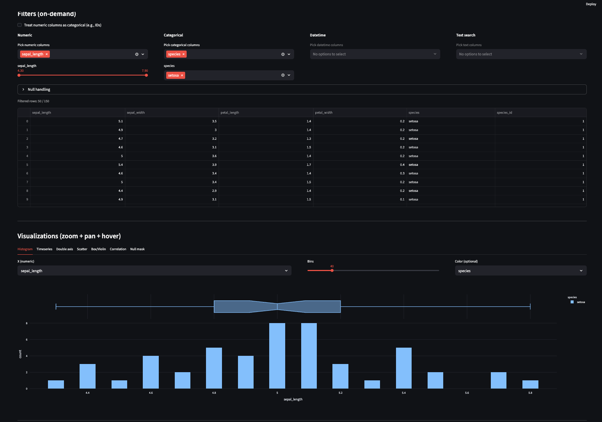
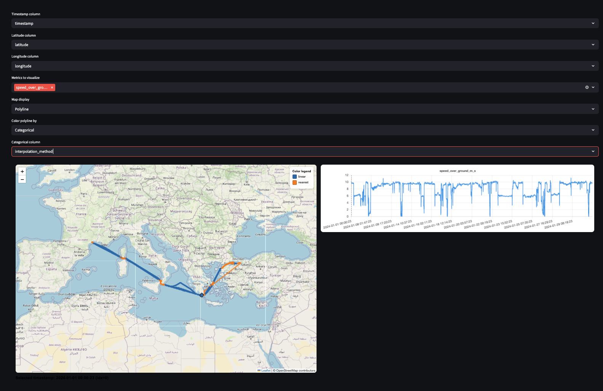

# Data visualization tool

Very simple (and opinionated) Streamlit dashboard to explore and visualize data. It supports:
-  Different dataset formats (`parquet`, `csv`, `json`).
-  Automatic detection of datetime columns and coercion.
-  Interactive filters for numeric, categorical, datetime and text columns.
-  A set of pre-built visualizations (histograms, scatter plots, line charts, and geospatial visualizations).
-  State persistence across sessions.

# Run
Run the following command to build and run the Interactive Data Visualization Dashboard using Docker:
`docker build -f Dockerfile -t dashboard  https://github.com/pacanada/data-viz.git#main  && docker run -it -p 8501:8501 dashboard`

# Examples:
## Preview

## Visualizations
### Histogram

### Correlation

## Filters

## Geospatial

